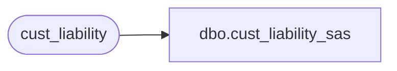

# dbo.cust_liability_sas

**Database:** auditworks_external  
**Server:** bedrockdb01  

## Architecture Diagram



## Table Dependencies

| Referenced Table |
|---|
| cust_liability |

## View Code

```sql
create view dbo.cust_liability_sas  as
select reference_type, reference_no, key_store_no, date_issued, issuing_store_no, 
title, first_name, last_name, address_1, address_2, city, county, state, country, post_code, telephone_no1, telephone_no2, customer_no, pos_tax_jurisdiction_code, fax, email_address, 
             expiry_date, original_amount, pos_status, pos_amount_1, pos_amount_2, pos_amount_3, last_modified_by_pos, employee_no, stocked_amount, stocked_stolen_flag, date_4, last_client_activity_date
from cust_liability
```

