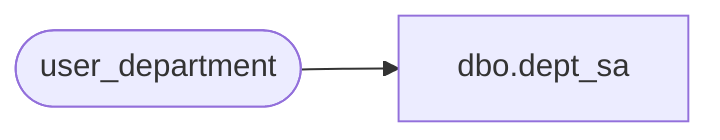

# dbo.dept_sa

**Database:** auditworks_external  
**Server:** bedrockdb01  

## Architecture Diagram



## Table Dependencies

| Referenced Table |
|---|
| user_department |

## View Code

```sql
create view dbo.dept_sa AS
    SELECT upc_lookup_division, department_code, department_description, resource_id
FROM user_department
```

