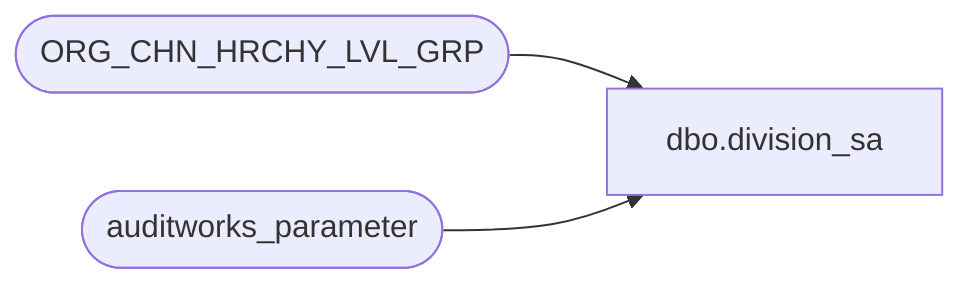

# dbo.division_sa

**Database:** auditworks_external  
**Server:** bedrockdb01  

## Architecture Diagram



## Table Dependencies

| Referenced Table |
|---|
| ORG_CHN_HRCHY_LVL_GRP |
| auditworks_parameter |

## View Code

```sql
create view dbo.division_sa 
AS
SELECT CONVERT(smallint, HRCHY_LVL_GRP_CODE) AS division_code,
       HRCHY_LVL_GRP_DESC AS division_name,
       convert(numeric(12,0), null) AS resource_id
  FROM auditworks_parameter p, 
       ORG_CHN_HRCHY_LVL_GRP g
 WHERE p.par_name = 'division_HRCHY_LVL_ID'
   AND p.par_bin_value = g.HRCHY_LVL_ID
   AND IsNumeric(HRCHY_LVL_GRP_CODE) = 1
```

