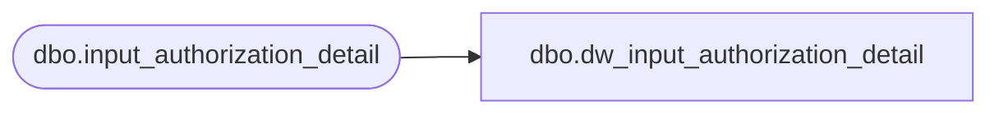

# dbo.dw_input_authorization_detail

**Database:** auditworks_external  
**Server:** bedrockdb01  

## Architecture Diagram



## Table Dependencies

| Referenced Table |
|---|
| dbo.input_authorization_detail |

## View Code

```sql
CREATE VIEW dbo.dw_input_authorization_detail AS
SELECT input_id,
       store_no,
       register_no,
       entry_date_time,
       transaction_series,
       transaction_no,
       line_id,
       customer_signature_obtained,
       authorization_no,
       expiry_date,
       swipe_indicator,
       approval_message,
       license_no,
       pos_state_code,
       other_id_type,
       other_id,
       card_type,
       deferred_billing_date,
       deferred_billing_plan,
       row_sequence_no,
       offline_flag FROM dbo.input_authorization_detail
```

