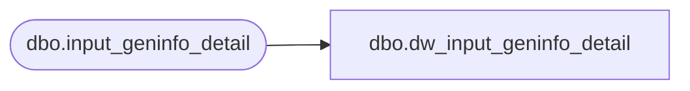

# dbo.dw_input_geninfo_detail

**Database:** auditworks_external  
**Server:** bedrockdb01  

## Architecture Diagram



## Table Dependencies

| Referenced Table |
|---|
| dbo.input_geninfo_detail |

## View Code

```sql
CREATE VIEW dbo.dw_input_geninfo_detail AS
SELECT input_id,
       store_no,
       register_no,
       entry_date_time,
       transaction_series,
       transaction_no,
       line_id,
       display_def_id,
       form_name,
       field_name,
       field_datatype,
       field_data_string,
       field_data_date,
       field_data_num,
       row_sequence_no FROM dbo.input_geninfo_detail
```

