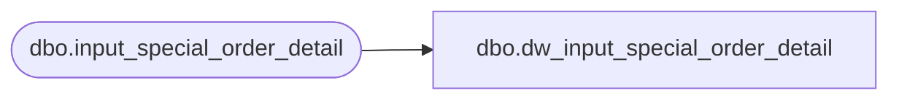

# dbo.dw_input_special_order_detail

**Database:** auditworks_external  
**Server:** bedrockdb01  

## Architecture Diagram



## Table Dependencies

| Referenced Table |
|---|
| dbo.input_special_order_detail |

## View Code

```sql
CREATE VIEW dbo.dw_input_special_order_detail AS
SELECT input_id,
       store_no,
       register_no,
       entry_date_time,
       transaction_series,
       transaction_no,
       line_id,
       units,
       units_sign,
       salesperson,
       merchandise_description,
       expecting_delivery_on,
       color_description,
       size_description,
       width_description,
       vendor_name,
       vendor_style_description,
       spo_class_description,
       vendor_no,
       row_sequence_no FROM dbo.input_special_order_detail
```

