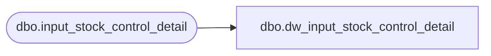

# dbo.dw_input_stock_control_detail

**Database:** auditworks_external  
**Server:** bedrockdb01  

## Architecture Diagram



## Table Dependencies

| Referenced Table |
|---|
| dbo.input_stock_control_detail |

## View Code

```sql
CREATE VIEW dbo.dw_input_stock_control_detail AS
SELECT input_id,
       store_no,
       register_no,
       entry_date_time,
       transaction_series,
       transaction_no,
       line_id,
       upc_no,
       merchandise_key,
       initiated_by_host,
       units,
       other_store_no,
       location_no,
       vendor_no,
       count_date,
       pos_deptclass,
       pos_identifier,
       pos_identifier_type,
       originating_store_no,
       reason,
       imrd,
       lookup_pos_code,
       pos_description,
       lookup_pos_code_imrd,
       pos_description_imrd,
       lookup_pos_code_vendor,
       pos_description_vendor,
       row_sequence_no,
       display_def_id FROM dbo.input_stock_control_detail
```

