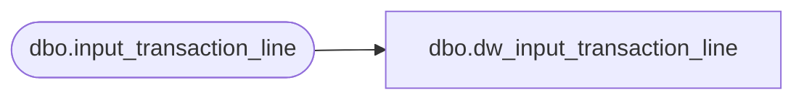

# dbo.dw_input_transaction_line

**Database:** auditworks_external  
**Server:** bedrockdb01  

## Architecture Diagram



## Table Dependencies

| Referenced Table |
|---|
| dbo.input_transaction_line |

## View Code

```sql
CREATE VIEW dbo.dw_input_transaction_line AS
SELECT input_id,
       store_no,
       register_no,
       entry_date_time,
       transaction_series,
       transaction_no,
       line_id,
       line_object,
       line_action,
       gross_line_amount,
       line_object_lookup_flag,
       line_amount_divider,
       pos_discount_amount,
       gross_line_amount_sign,
       line_void_flag,
       voiding_reversal_flag,
       attachment_qty,
       line_object_adjustment,
       reference_no,
       lookup_pos_code,
       pos_description_token_list,
       row_sequence_no,
       invalid_reference_no FROM dbo.input_transaction_line
```

