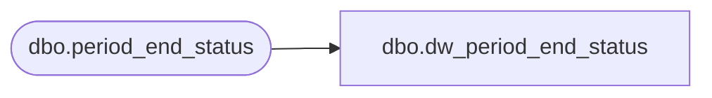

# dbo.dw_period_end_status

**Database:** auditworks_external  
**Server:** bedrockdb01  

## Architecture Diagram



## Table Dependencies

| Referenced Table |
|---|
| dbo.period_end_status |

## View Code

```sql
CREATE VIEW dbo.dw_period_end_status AS
SELECT instance_id,
       process_start_time,
       process_end_time,
       period_end_status
  FROM dbo.period_end_status
```

