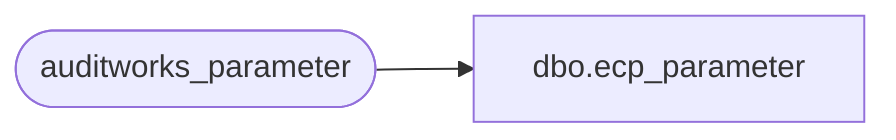

# dbo.ecp_parameter

**Database:** auditworks_external  
**Server:** bedrockdb01  

## Architecture Diagram



## Table Dependencies

| Referenced Table |
|---|
| auditworks_parameter |

## View Code

```sql
create view dbo.ecp_parameter 
as
  SELECT par_name,
       par_value,
       par_type,
       par_value_from_range,
       par_value_to_range,
       par_comment,
       code_type,
       resource_id,
       par_name_display_descr,
       min_compatible_exe,
       comment_resource_id,
       par_bin_value,
       par_group_code,
       drop_down_query,
       par_node_id,
       par_nullable_flag,
       warning_code,
       active_flag
  FROM auditworks_parameter
  where par_group_code like 'ECP%'
```

