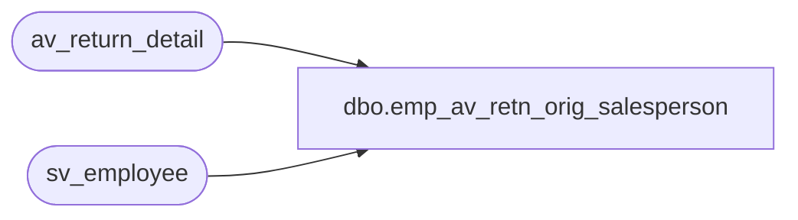

# dbo.emp_av_retn_orig_salesperson

**Database:** auditworks_external  
**Server:** bedrockdb01  

## Architecture Diagram



## Table Dependencies

| Referenced Table |
|---|
| av_return_detail |
| sv_employee |

## View Code

```sql
create view dbo.emp_av_retn_orig_salesperson as 
select distinct r.original_salesperson as employee_no,
    e.employee_first_name, e.employee_last_name, e.home_store_no,
    e.employee_type, e.verified,e.house_account_no,
    e.date_of_hire, e.date_of_termination,
    e.employee_department, e.employee_type_descr,
    e.timestamp
from av_return_detail r
left outer join sv_employee e
on r.original_salesperson = e.employee_no


                                                                                                                                                                                                                                                                                                                                                                                                                                                                                                                                                                                                                                                                                                                                                                                                                                                                                                                                                                                                                                                                                                                                                                                                                                                                                                                                                                                                                                                                                                                                                                                                                                                                                                                                                                                                                                                                                                                                                                                                                                                                                                                                                                                                                                                                                                                                                                                                                                                                                                                                                                                                                                                                                                                                                                                                                                                                                                                                                                                                                                                                                                                                                                                                                                                                                                                                                                                                                                                                                                                                                                     

dbo,flash_sales_postings,/* Dummy view needed for compilation and EXE without Flash. */
/* Will not overwrite existing view. */
/* Replaced when FLASH_SA is installed */

create view dbo.flash_sales_postings
as 
select	class_code = null,
	store_no = 0,
	transaction_date = '01-JAN-1999',
	units_sold = 0,
	retail_sold = 0,
	cost_sold = 0,
	batch_no = 0,
	markdown_sold = 0
from dbo.code_description
```

