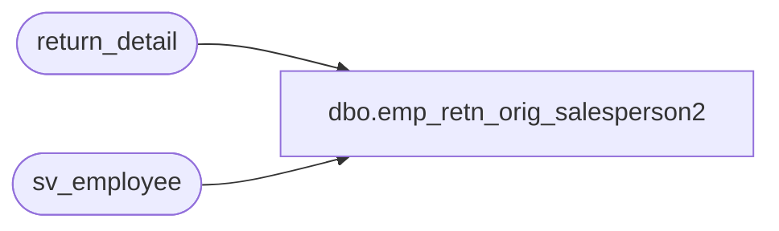

# dbo.emp_retn_orig_salesperson2

**Database:** auditworks_external  
**Server:** bedrockdb01  

## Architecture Diagram



## Table Dependencies

| Referenced Table |
|---|
| return_detail |
| sv_employee |

## View Code

```sql
create view dbo.emp_retn_orig_salesperson2 as 
select distinct r.original_salesperson2 as employee_no,
    e.employee_first_name, e.employee_last_name, e.home_store_no,
    e.employee_type, e.verified,e.house_account_no,
    e.date_of_hire, e.date_of_termination,
    e.employee_department, e.employee_type_descr,
    e.timestamp
from return_detail r
left outer join sv_employee e
on r.original_salesperson2 = e.employee_no
```

