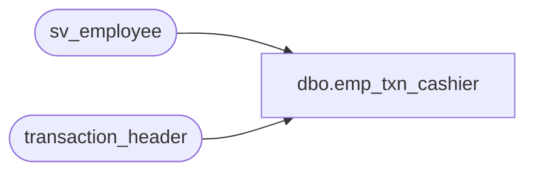

# dbo.emp_txn_cashier

**Database:** auditworks_external  
**Server:** bedrockdb01  

## Architecture Diagram



## Table Dependencies

| Referenced Table |
|---|
| sv_employee |
| transaction_header |

## View Code

```sql
create view dbo.emp_txn_cashier as 
select distinct h.cashier_no as employee_no,
    e.employee_first_name, e.employee_last_name, e.home_store_no,
    e.employee_type, e.verified,e.house_account_no,
    e.date_of_hire, e.date_of_termination,
    e.employee_department, e.employee_type_descr,
    e.timestamp
from transaction_header h    
left outer join sv_employee e
on h.cashier_no = e.employee_no

                                                                                                                                                                                                                                                                                                                                                                                                                                                                                                                                                                                                                                                                                                                                                                                                                                                                                                                                                                                                                                                                                                                                                                                                                                                                                                                                                                                                                                                                                                                                                                                                                                                                                                                                                                                                                                                                                                                                                                                                                                                                                                                                                                                                                                                                                                                                                                                                                                                                                                                                                                                                                                                                                                                                                                                                                                                                                                                                                                                                                                                                                                                                                                                                                                                                                                                                                                                                                                                                                                                                                                                                                 

dbo,register,-- don't drop to avoid losing customized view

create view dbo.register as
SELECT	store_no = OCW.ORG_CHN_NUM,
	register_no = OCW.WRKSTN_NUM,
	register_name = OCW.CMPTR_NAME,
	register_function = CASE WHEN OCW.WRKSTN_ID = OCW.PRNT_WRKSTN_ID OR OCW.PRNT_WRKSTN_ID IS NULL THEN 9000 ELSE 1 END,
	register_poll_id = OCW.PLNG_IDNTFR, -- numeric max 4 digits
	resource_id = NULL, --no longer in use
	reg_pre_midnight_time = OCW.BSNS_DAY_END_RNG_START_TIME,
	reg_post_midnight_time = OCW.BSNS_DAY_END_RNG_END_TIME,
	OCW.WRKSTN_ID, -- = PRNT_WRKSTN_ID for server reg
	OCW.PRNT_WRKSTN_ID, -- WRKSTN_ID of parent server reg
	OCW.ACTV
 FROM ORG_CHN_WRKSTN OCW
```

