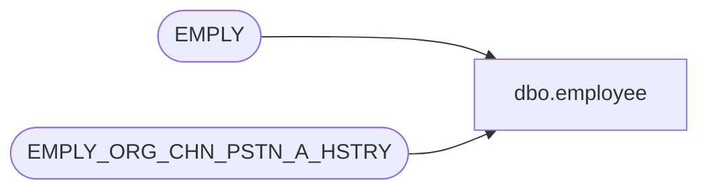

# dbo.employee

**Database:** auditworks_external  
**Server:** bedrockdb01  

## Architecture Diagram



## Table Dependencies

| Referenced Table |
|---|
| EMPLY |
| EMPLY_ORG_CHN_PSTN_A_HSTRY |

## View Code

```sql
create view dbo.employee AS
SELECT employee_no = E.EMPLY_NUM,
       employee_first_name = E.FRST_NAME,
       employee_last_name = E.LAST_NAME,
       home_store_no = COALESCE(EOCPA.ORG_CHN_NUM, E.PRMY_ORG_CHN_NUM), -- nonnull in SA5
       employee_type = COALESCE(EOCPA.PSTN_CODE, E.TTL_PSTN_CODE), -- could be null
       verified = 0,
       house_account_no = E.HS_ACNT_NUM,
       employee_department = EOCPA.PRMRY_DISP_FNCTN_NUM, --selling area
       timestamp = NULL,
       active_flag = E.ACTV
 FROM  EMPLY E 
	LEFT JOIN EMPLY_ORG_CHN_PSTN_A_HSTRY EOCPA ON (E.EMPLY_NUM = EOCPA.EMPLY_NUM
	 AND EOCPA.EFCTV_DATE <= getdate() AND (EOCPA.EXPRTN_DATE IS NULL OR EOCPA.EXPRTN_DATE > getdate()))
	 AND PRMRY_LOC_A = 1
```

