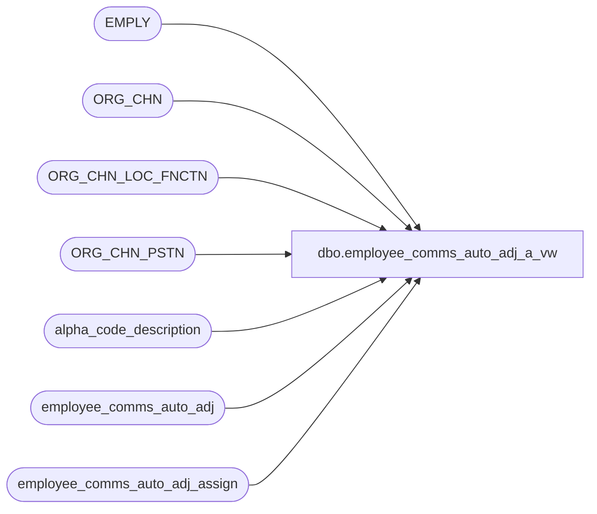

# dbo.employee_comms_auto_adj_a_vw

**Database:** auditworks_external  
**Server:** bedrockdb01  

## Architecture Diagram



## Table Dependencies

| Referenced Table |
|---|
| EMPLY |
| ORG_CHN |
| ORG_CHN_LOC_FNCTN |
| ORG_CHN_PSTN |
| alpha_code_description |
| employee_comms_auto_adj |
| employee_comms_auto_adj_assign |

## View Code

```sql
CREATE VIEW employee_comms_auto_adj_a_vw
AS
SELECT aa.auto_commission_adj_id, a.auto_adjustment_description, 
       CASE WHEN employee_no <> -1
            THEN '10_employee_no'
            ELSE CASE WHEN employee_commission_code <> '-1' 
                      THEN '20_employee_commission_code'
                      ELSE CASE WHEN primary_selling_area_no <> -1
                                THEN '30_primary_selling_area_no'
                                ELSE CASE WHEN primary_position <> '-1'
                                          THEN '40_primary_position'
                                          ELSE CASE WHEN home_store_no <> -1
                                                    THEN '60_home_store_no'
                                                    ELSE CASE WHEN home_store_commission_code <> '-1'
                                                              THEN '70_home_store_commission_code'
                                                              ELSE '20_employee_commission_code'
                                                         END
                                               END
                                     END
                           END
                  END
       END assignment_type,
       COALESCE(CONVERT(VARCHAR, e.EMPLY_NUM), CONVERT(VARCHAR, o.ORG_CHN_NUM), cc.code, p.PSTN_CODE, CONVERT(VARCHAR, s.FNCTN_NUM)) code, 
       COALESCE(CASE WHEN e.FRST_NAME IS NULL THEN e.LAST_NAME ELSE CASE WHEN e.LAST_NAME IS NULL THEN e.FRST_NAME ELSE e.LAST_NAME + ', ' + e.FRST_NAME END END, o.ORG_CHN_NAME, cc.code_display_descr1, p.PSTN_DESC, s.FNCTN_DESC) description
  FROM employee_comms_auto_adj_assign aa
       INNER JOIN employee_comms_auto_adj a
          ON a.auto_commission_adj_id = aa.auto_commission_adj_id
       LEFT OUTER JOIN EMPLY e
         ON aa.employee_no = e.EMPLY_NUM
        AND aa.employee_no <> -1
       LEFT OUTER JOIN ORG_CHN o
         ON aa.home_store_no = o.ORG_CHN_NUM
        AND aa.home_store_no <> -1
       LEFT OUTER JOIN alpha_code_description cc
         ON cc.code_type in (13, 15)
        AND cc.code_status = 'U'
        AND (   (cc.code_type = 13 AND cc.code = aa.home_store_commission_code AND aa.home_store_commission_code <> '-1')
             OR (    cc.code_type = 15 AND cc.code = aa.employee_commission_code 
                 AND (   aa.employee_commission_code <> '-1' 
                      OR (aa.home_store_commission_code = '-1' AND aa.employee_no = -1 AND aa.primary_selling_area_no = -1 AND aa.home_store_no = -1 AND aa.primary_position = '-1')
                     )  
                ))
       LEFT OUTER JOIN ORG_CHN_PSTN p
         ON aa.primary_position= p.PSTN_CODE
       LEFT OUTER JOIN ORG_CHN_LOC_FNCTN s
         ON aa.primary_selling_area_no = s.FNCTN_NUM
        AND aa.primary_selling_area_no <> -1
```

