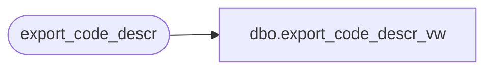

# dbo.export_code_descr_vw

**Database:** auditworks_external  
**Server:** bedrockdb01  

## Architecture Diagram



## Table Dependencies

| Referenced Table |
|---|
| export_code_descr |

## View Code

```sql
create view dbo.export_code_descr_vw 
AS SELECT code_type, code, code_display_descr, code_meaning_control, code_system_descr,
          resource_id, min_compatible_exe
FROM export_code_descr
```

