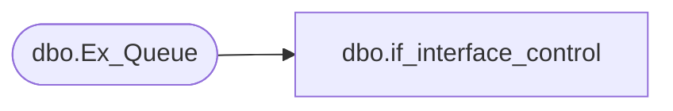

# dbo.if_interface_control

**Database:** auditworks_external  
**Server:** bedrockdb01  

## Architecture Diagram



## Table Dependencies

| Referenced Table |
|---|
| dbo.Ex_Queue |

## View Code

```sql
create view dbo.if_interface_control  
AS 
SELECT if_entry_no = key_1, 
	interface_id = queue_id, 
	interface_control_flag = key_2, 
	effective_date = key_9, 
	interface_posting_date = key_10,
	if_rejection_rules_overriden = key_4
  FROM auditworks_external.dbo.Ex_Queue
```

