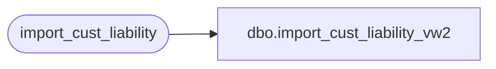

# dbo.import_cust_liability_vw2

**Database:** auditworks_external  
**Server:** bedrockdb01  

## Architecture Diagram



## Table Dependencies

| Referenced Table |
|---|
| import_cust_liability |

## View Code

```sql
create view dbo.import_cust_liability_vw2  as
select rule_id, reference_no, date_issued_formatted, action_amount, issuing_store_no, customer_no, first_name,
       last_name, address_1, city, state, country, post_code, telephone_no1
from import_cust_liability
```

