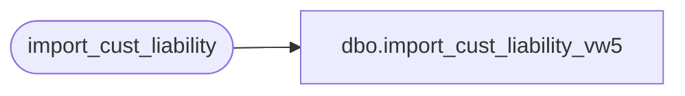

# dbo.import_cust_liability_vw5

**Database:** auditworks_external  
**Server:** bedrockdb01  

## Architecture Diagram



## Table Dependencies

| Referenced Table |
|---|
| import_cust_liability |

## View Code

```sql
create view dbo.import_cust_liability_vw5 as
select rule_id, reference_no, date_issued_formatted, action_amount, issuing_store_no, upc_no, pos_identifier, pos_identifier_type, units, 
       customer_no, employee_no, title, first_name, last_name, address_1, address_2, city, 
       county, state, country, post_code, pos_tax_jurisdiction_code, telephone_no1, telephone_no2, fax, 
       email_address, replacement_reference_no, destination_store_no, expiry_date, serial_no
from import_cust_liability
```

