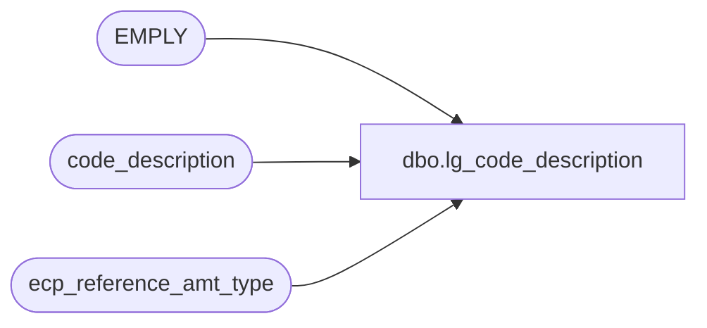

# dbo.lg_code_description

**Database:** auditworks_external  
**Server:** bedrockdb01  

## Architecture Diagram



## Table Dependencies

| Referenced Table |
|---|
| EMPLY |
| code_description |
| ecp_reference_amt_type |

## View Code

```sql
create view dbo.lg_code_description  
as
SELECT s.code_type
,s.code
,s.code_display_descr as code_display_descr
,s.code_meaning_control
,s.code_system_descr
,s.resource_id
,s.min_compatible_exe
,s.alpha_code 
,s.active_flag
FROM code_description s
WHERE s.active_flag > 0
UNION
SELECT 193 code_type, EMPLY_NUM code, 
       IsNull((IsNull(e.LAST_NAME, '') + Substring(', ', 1, sign(datalength(e.LAST_NAME) * datalength(e.FRST_NAME)) * 2)  + IsNull(e.FRST_NAME, '')), '') + ' (' + convert(nvarchar, e.EMPLY_NUM) + ')' code_display_descr, 
       'U' code_meaning_control,
       IsNull((IsNull(e.LAST_NAME, '') + Substring(', ', 1, sign(datalength(e.LAST_NAME) * datalength(e.FRST_NAME)) * 2)  + IsNull(e.FRST_NAME, '')), '') + ' (' + convert(nvarchar, e.EMPLY_NUM) + ')' code_system_descr, 
       convert(numeric(12,0), null) resource_id,
       '4.1.001.050' min_compatible_exe,
       convert(nvarchar(20), null) alpha_code,       
       1 active_flag
  FROM EMPLY e
UNION
SELECT 192 code_type, reference_amount_type code, 
       s.reference_amount_type_descr code_display_descr,
       CASE WHEN s.reference_amount_type in (1, 2) THEN 'S' ELSE 'U' END code_meaning_control,
       s.reference_amount_type_descr code_system_descr,
       s.resource_id,
       '4.1.001.050' min_compatible_exe,
       convert(nvarchar(20), null) alpha_code,       
       s.active_flag
 FROM ecp_reference_amt_type s
WHERE s.active_flag > 0
```

