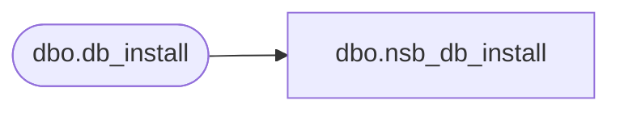

# dbo.nsb_db_install

**Database:** auditworks_external  
**Server:** bedrockdb01  

## Architecture Diagram



## Table Dependencies

| Referenced Table |
|---|
| dbo.db_install |

## View Code

```sql
CREATE VIEW [dbo].[nsb_db_install] (execution_id, install_id, original_filename, generated_by, executed_by, execution_date, execution_status, application_name) AS SELECT execution_id, install_id, original_filename, generated_by, executed_by, execution_date, execution_status, application_name FROM [dbo].[db_install]
```

