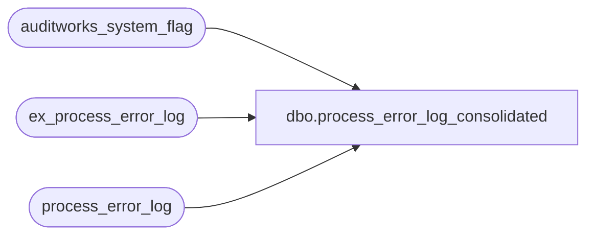

# dbo.process_error_log_consolidated

**Database:** auditworks_external  
**Server:** bedrockdb01  

## Architecture Diagram



## Table Dependencies

| Referenced Table |
|---|
| auditworks_system_flag |
| ex_process_error_log |
| process_error_log |

## View Code

```sql
CREATE VIEW process_error_log_consolidated
AS
SELECT convert(int, s.flag_numeric_value) instance_id, p.*
  FROM process_error_log p, auditworks_system_flag s
 WHERE s.flag_name = 'instance_id'
UNION
SELECT -1 instance_id, p.*
  FROM ex_process_error_log p, auditworks_system_flag s, auditworks_system_flag e
 WHERE s.flag_name = 'instance_id'
   AND s.flag_numeric_value = 0  --i.e. if dw or not scaleout, include external archive entries
   AND e.flag_name = 'external_archive_in_use'
   AND e.flag_numeric_value = 1
```

