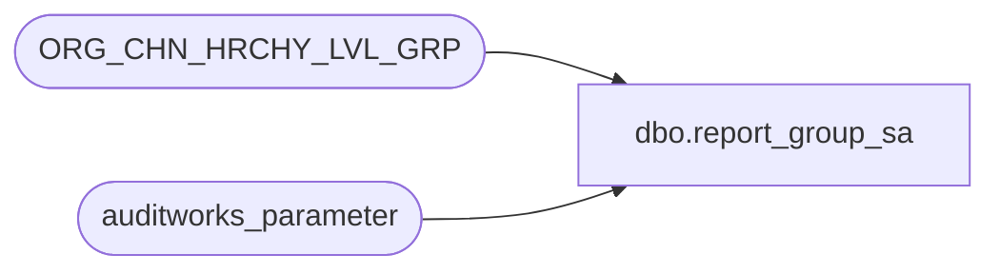

# dbo.report_group_sa

**Database:** auditworks_external  
**Server:** bedrockdb01  

## Architecture Diagram



## Table Dependencies

| Referenced Table |
|---|
| ORG_CHN_HRCHY_LVL_GRP |
| auditworks_parameter |

## View Code

```sql
create view dbo.report_group_sa
AS
SELECT HRCHY_LVL_GRP_IDNTY AS report_group_code,
       SUBSTRING(g.HRCHY_LVL_GRP_DESC, 1, 20) AS report_group_description
  FROM auditworks_parameter p, 
       ORG_CHN_HRCHY_LVL_GRP g
 WHERE p.par_name = 'report_group_HRCHY_LVL_ID'
   AND p.par_bin_value = g.HRCHY_LVL_ID
```

