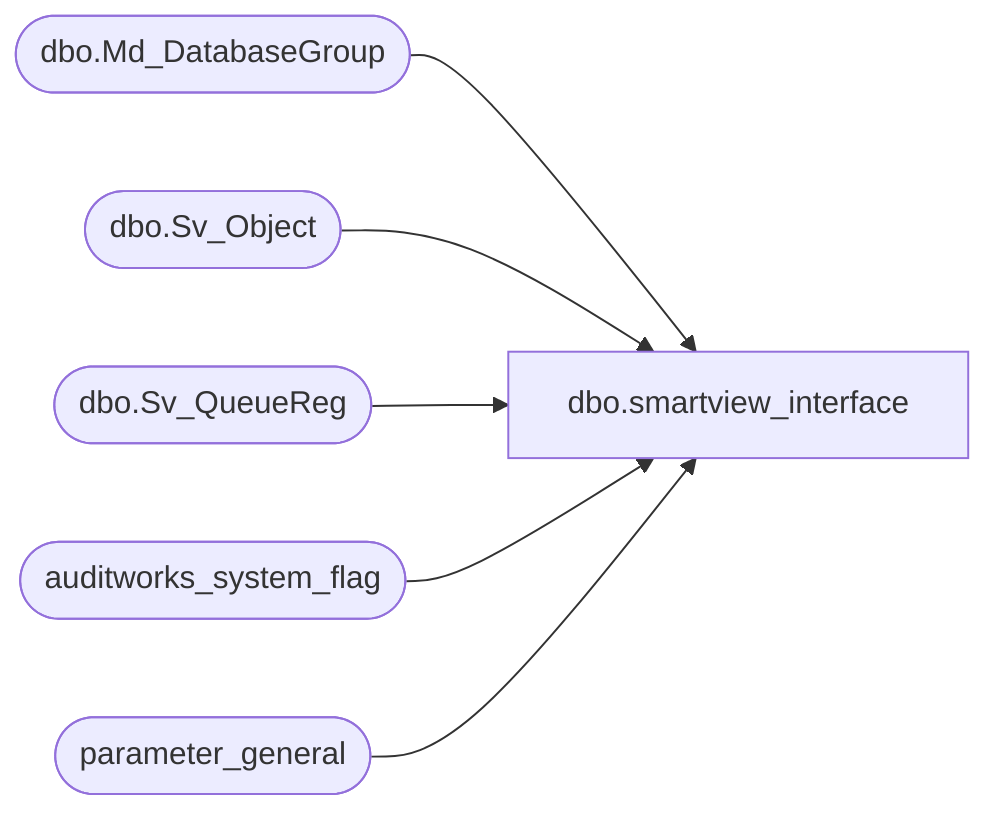

# dbo.smartview_interface

**Database:** auditworks_external  
**Server:** bedrockdb01  

## Architecture Diagram



## Table Dependencies

| Referenced Table |
|---|
| dbo.Md_DatabaseGroup |
| dbo.Sv_Object |
| dbo.Sv_QueueReg |
| auditworks_system_flag |
| parameter_general |

## View Code

```sql
CREATE VIEW dbo.smartview_interface 
AS
SELECT q.queue_id, 
       q.object_id, 
       o.label_1 description 
  FROM parameter_general p
       LEFT OUTER JOIN auditworks_system_flag f
         ON f.flag_name = 'fnd_sa_company_id'
        AND f.flag_alpha_value IS NOT NULL
        AND f.flag_alpha_value <> ''
       INNER JOIN foundation.dbo.Md_DatabaseGroup d
          ON d.topic_id = 14
         AND d.sec_company_id = COALESCE(CONVERT(int, f.flag_alpha_value), p.sa_company_no)
       INNER JOIN foundation.dbo.Sv_QueueReg q
          ON d.db_group_id = q.db_group_id
        LEFT OUTER JOIN foundation.dbo.Sv_Object o
          ON q.object_id = o.object_id
```

