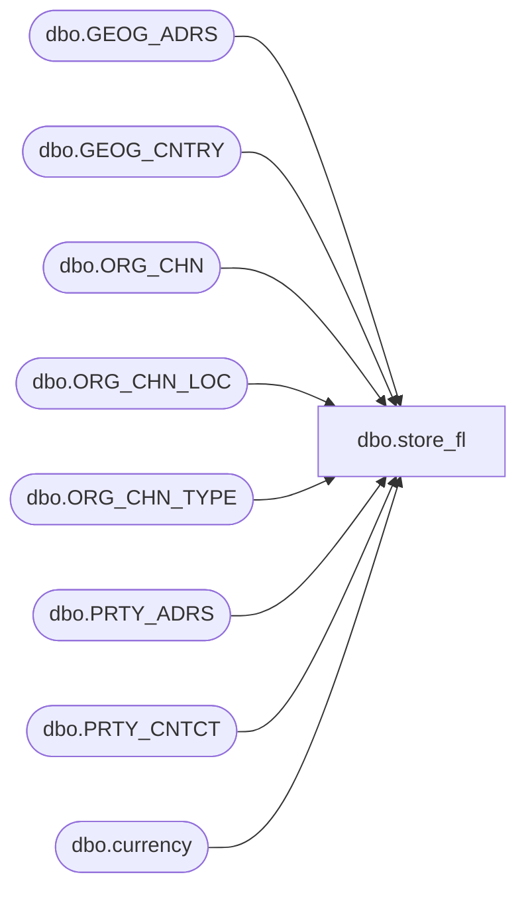

# dbo.store_fl

**Database:** auditworks_external  
**Server:** bedrockdb01  

## Architecture Diagram



## Table Dependencies

| Referenced Table |
|---|
| dbo.GEOG_ADRS |
| dbo.GEOG_CNTRY |
| dbo.ORG_CHN |
| dbo.ORG_CHN_LOC |
| dbo.ORG_CHN_TYPE |
| dbo.PRTY_ADRS |
| dbo.PRTY_CNTCT |
| dbo.currency |

## View Code

```sql
create view dbo.store_fl  AS
SELECT 
	store_no = OC.ORG_CHN_NUM, 
	store_name = OC.ORG_CHN_NAME, 
	store_short_name = OC.ORG_CHN_SHRT_NAME,  
	store_manager = NULL, --no longer available
	selling_space = SUM(OCL.AREA_SIZE), 
	open_period = NULL,  --no longer available
	comp_period = NULL,  --no longer available
	closed_date = OC.CLS_DATE, 
	selling_nonselling_flag = CASE WHEN OCT.SYS_CODE = 'WH' OR OCT.SYS_CODE = 'DC' THEN 0 ELSE 1 END, 
 	phone_no = PH.CNTCT,
	gl_company = OC.GL_CMPNY_NUM,
	currency_id = cu.currency_id,
	country_id = 0, -- updated later using country table in flash db
	comp_date = OC.COMP_DATE,
	open_date = OC.OPEN_DATE,
	country_code = GC.CNTRY_CODE_ISO2,
	store_status_code = OC.ACTV, -- can customize if used by flash queries
	division_code = 0,
	region_code = 0,
	district_code = 0
 FROM dbo.ORG_CHN OC
 JOIN dbo.ORG_CHN_TYPE OCT 
      ON OC.ORG_CHN_TYPE_CODE = OCT.ORG_CHN_TYPE_CODE
 JOIN dbo.currency cu
      ON OC.DFLT_CRNCY_CODE = cu.currency_code
 LEFT OUTER JOIN dbo.ORG_CHN_LOC OCL
      ON OC.ORG_CHN_NUM = OCL.ORG_CHN_NUM
 LEFT OUTER JOIN dbo.PRTY_ADRS PA
      ON OC.PRTY_ID = PA.PRTY_ID
      AND OC.DFLT_ADRS_SEQ = PA.PRTY_ADRS_SEQ
      AND PA.EFCTV_STRT_DATE <= GETDATE()
      AND (PA.EFCTV_END_DATE >= GETDATE() OR PA.EFCTV_END_DATE IS NULL)      
 LEFT OUTER JOIN dbo.GEOG_ADRS GA 
      ON PA.ADRS_ID = GA.ADRS_ID     
 LEFT OUTER JOIN dbo.PRTY_CNTCT PH
      ON OC.PRTY_ID = PH.PRTY_ID
      AND PH.CNTCT_TYPE_CODE = 'TLPH' 
      AND SEQ_NUM = 1  --- primary
 LEFT OUTER JOIN dbo.GEOG_CNTRY GC
      ON GA.CNTRY_CODE_ISO3 = GC.CNTRY_CODE_ISO3
GROUP BY OC.ORG_CHN_NUM, OC.ORG_CHN_NAME, OC.ORG_CHN_SHRT_NAME,
         OC.CLS_DATE, OCT.SYS_CODE,
         OC.ORG_CHN_TYPE_CODE, PH.CNTCT,
         OC.GL_CMPNY_NUM,
         cu.currency_id, OC.COMP_DATE, 
         OC.OPEN_DATE, GC.CNTRY_CODE_ISO2,
         OC.ORG_CHN_TYPE_CODE,
         OC.ACTV
```

