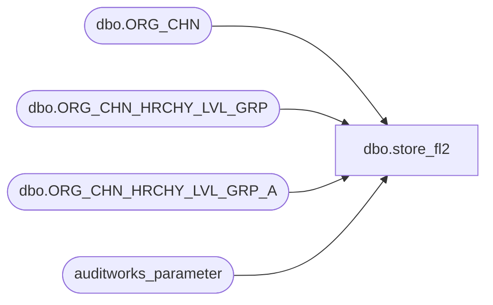

# dbo.store_fl2

**Database:** auditworks_external  
**Server:** bedrockdb01  

## Architecture Diagram



## Table Dependencies

| Referenced Table |
|---|
| dbo.ORG_CHN |
| dbo.ORG_CHN_HRCHY_LVL_GRP |
| dbo.ORG_CHN_HRCHY_LVL_GRP_A |
| auditworks_parameter |

## View Code

```sql
create view dbo.store_fl2 
 AS
SELECT -- customize view to join to appropriate hierarchy after creating them in tm. Could hardcode unused columns to 0.
            store_no = OC.ORG_CHN_NUM, 
            division_code = (SELECT hl.HRCHY_LVL_GRP_CODE
            		FROM dbo.ORG_CHN_HRCHY_LVL_GRP hl, dbo.ORG_CHN_HRCHY_LVL_GRP_A hla, auditworks_parameter p
            		WHERE p.par_name = 'division_HRCHY_LVL_ID'
                          AND p.par_bin_value = hl.HRCHY_LVL_ID
                          AND IsNumeric(HRCHY_LVL_GRP_CODE) = 1
                        AND hl.HRCHY_LVL_GRP_ID = hla.HRCHY_LVL_GRP_ID
            		AND hl.HRCHY_ID = hla.HRCHY_ID
            		AND hl.HRCHY_LVL_ID = hla.HRCHY_LVL_ID
           		AND OC.ORG_CHN_NUM = hla.ORG_CHN_NUM),
            region_code = (SELECT hl.HRCHY_LVL_GRP_CODE
            		FROM dbo.ORG_CHN_HRCHY_LVL_GRP hl, dbo.ORG_CHN_HRCHY_LVL_GRP_A hla, auditworks_parameter p
            		WHERE p.par_name = 'region_HRCHY_LVL_ID'
                          AND p.par_bin_value = hl.HRCHY_LVL_ID
                          AND IsNumeric(HRCHY_LVL_GRP_CODE) = 1
                        AND hl.HRCHY_LVL_GRP_ID = hla.HRCHY_LVL_GRP_ID
            		AND hl.HRCHY_ID = hla.HRCHY_ID
            		AND hl.HRCHY_LVL_ID = hla.HRCHY_LVL_ID
           		AND OC.ORG_CHN_NUM = hla.ORG_CHN_NUM),
            district_code = (SELECT hl.HRCHY_LVL_GRP_CODE
            		FROM dbo.ORG_CHN_HRCHY_LVL_GRP hl, dbo.ORG_CHN_HRCHY_LVL_GRP_A hla, auditworks_parameter p
            		WHERE p.par_name = 'region_HRCHY_LVL_ID'
                          AND p.par_bin_value = hl.HRCHY_LVL_ID
                          AND IsNumeric(HRCHY_LVL_GRP_CODE) = 1
                        AND hl.HRCHY_LVL_GRP_ID = hla.HRCHY_LVL_GRP_ID
            		AND hl.HRCHY_ID = hla.HRCHY_ID
            		AND hl.HRCHY_LVL_ID = hla.HRCHY_LVL_ID
           		AND OC.ORG_CHN_NUM = hla.ORG_CHN_NUM)
 FROM dbo.ORG_CHN OC
```

