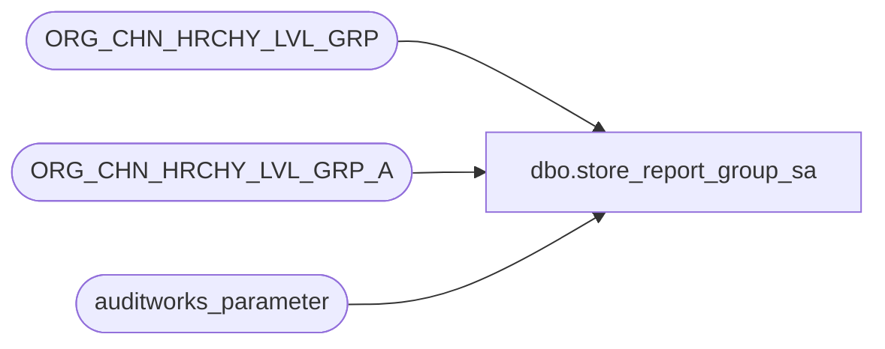

# dbo.store_report_group_sa

**Database:** auditworks_external  
**Server:** bedrockdb01  

## Architecture Diagram



## Table Dependencies

| Referenced Table |
|---|
| ORG_CHN_HRCHY_LVL_GRP |
| ORG_CHN_HRCHY_LVL_GRP_A |
| auditworks_parameter |

## View Code

```sql
create view dbo.store_report_group_sa
AS
SELECT s.ORG_CHN_NUM store_no,
       g.HRCHY_LVL_GRP_IDNTY report_group_code 
  FROM auditworks_parameter p, 
       ORG_CHN_HRCHY_LVL_GRP g,
       ORG_CHN_HRCHY_LVL_GRP_A s
 WHERE p.par_name = 'report_group_HRCHY_LVL_ID'
   AND p.par_bin_value = g.HRCHY_LVL_ID
   AND g.HRCHY_LVL_GRP_ID = s.HRCHY_LVL_GRP_ID
```

