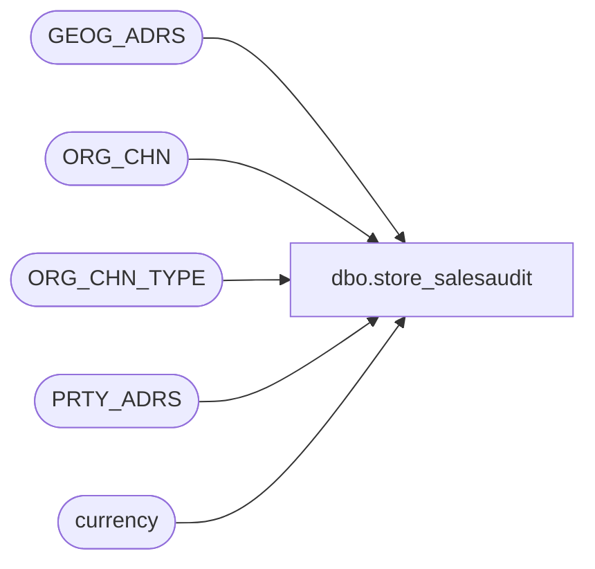

# dbo.store_salesaudit

**Database:** auditworks_external  
**Server:** bedrockdb01  

## Architecture Diagram



## Table Dependencies

| Referenced Table |
|---|
| GEOG_ADRS |
| ORG_CHN |
| ORG_CHN_TYPE |
| PRTY_ADRS |
| currency |

## View Code

```sql
CREATE VIEW dbo.store_salesaudit AS
SELECT 
	store_no = OC.ORG_CHN_NUM,
	tax_jurisdiction = OC.TAX_JRSDCTN_CODE,
	tax_strip_table_no = NULL, --no longer in use
	media_parameter_table_no = OC.MD_PRMTR_TBL_NUM,
	balancing_method = NULL, --no longer in use for new installs
	deposit_balancing_method = NULL, --no longer in use for new installs
	petty_cash_line_object = NULL, --no longer in use for new installs
	multiple_mediacounts_added = NULL, --no longer in use for new installs
	autoaccept_flag = OC.AUTO_ACPT,
	tax_strip_flag = NULL, --no longer in use
	outlet_store_flag = OC.ORG_CHN_TYPE_CODE,
	settlement_billing_name = OC.STLMNT_BLNG_NAME,
	store_deposit_destination = OC.PRMRY_BANK_ACNT_ID,
	interstore_export_region = OC.VCHR_CNFG_TYPE,
	gl_company = OC.GL_CMPNY_NUM,
	gl_store = OC.GL_LOC_NUM,
	country_id = GA.CNTRY_CODE_ISO3,
	timezone_offset_hours = OC.GMT_OFST,
	city = GA.CITY,
	state_code = GA.TRTRY_CODE,
	zip_code = GA.POST_CODE,
	comp_date = OC.COMP_DATE,
	store_export_code = OC.ORG_CHN_TYPE_CODE,
	open_date = OC.OPEN_DATE,
	log_tax_override = CASE WHEN OCT.SYS_CODE = 'WEB' OR OCT.SYS_CODE = 'CTLG' THEN 1 ELSE 2 END,
	currency_id = cu.currency_id,
	email_address = NULL,
	OC.ACTV
FROM ORG_CHN OC
     INNER JOIN ORG_CHN_TYPE OCT ON (OCT.ORG_CHN_TYPE_CODE = OC.ORG_CHN_TYPE_CODE)
     INNER JOIN PRTY_ADRS PA ON (PA.PRTY_ID = OC.PRTY_ID AND PA.ADRS_FNCTN_CODE = 'PRMY'
           AND PA.EFCTV_STRT_DATE < GETDATE()
           AND (PA.EFCTV_END_DATE >= GETDATE() OR PA.EFCTV_END_DATE IS NULL))
     INNER JOIN GEOG_ADRS GA ON (GA.ADRS_ID = PA.ADRS_ID)
     INNER JOIN currency cu ON (OC.DFLT_CRNCY_CODE = cu.currency_code)
```

