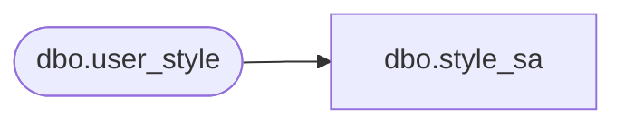

# dbo.style_sa

**Database:** auditworks_external  
**Server:** bedrockdb01  

## Architecture Diagram



## Table Dependencies

| Referenced Table |
|---|
| dbo.user_style |

## View Code

```sql
create view dbo.style_sa  
  AS 
  SELECT upc_lookup_division, 
         style_reference_id,
         style_short_description = ISNULL(style_short_description,LEFT(style_long_description,20)),
         style_long_description,
         class_code,
         subclass_code,
         cost,
         style_code, 
	 tax_item_group_id
    FROM auditworks_external.dbo.user_style
```

