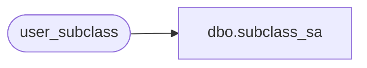

# dbo.subclass_sa

**Database:** auditworks_external  
**Server:** bedrockdb01  

## Architecture Diagram



## Table Dependencies

| Referenced Table |
|---|
| user_subclass |

## View Code

```sql
create view dbo.subclass_sa  
AS
  SELECT sc.class_code, sc.subclass_code, sc.subclass_description
    FROM user_subclass sc
```

