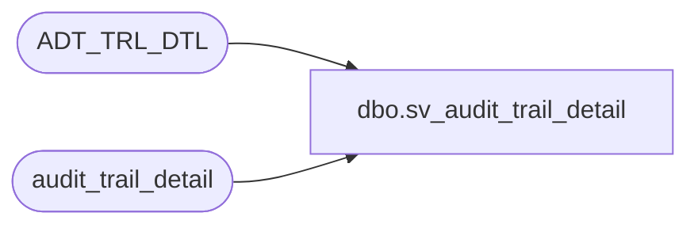

# dbo.sv_audit_trail_detail

**Database:** auditworks_external  
**Server:** bedrockdb01  

## Architecture Diagram



## Table Dependencies

| Referenced Table |
|---|
| ADT_TRL_DTL |
| audit_trail_detail |

## View Code

```sql
create view dbo.sv_audit_trail_detail as
select entry_id,
       column_name,
       before_value,
       after_value,
       before_description,
       after_description
from audit_trail_detail
UNION       
select entry_id =ENTRY_ID,
       column_name =CLMN_NAME,
       before_value = OLD_VAL,
       after_value = NEW_VAL,
       before_description =OLD_VAL,
       after_description = NEW_VAL
FROM ADT_TRL_DTL
```

