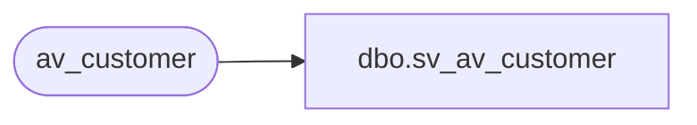

# dbo.sv_av_customer

**Database:** auditworks_external  
**Server:** bedrockdb01  

## Architecture Diagram



## Table Dependencies

| Referenced Table |
|---|
| av_customer |

## View Code

```sql
create view dbo.sv_av_customer as

/* SmartView: Rename the av_transaction_id field */

SELECT transaction_id = av_transaction_id, line_id, customer_role,
	title, first_name, last_name, address_1, address_2, city, county,
	state, country, post_code, telephone_no1, telephone_no2, 
	customer_no, more_info_flag, pos_tax_jurisdiction_code, fax, email_address
	FROM av_customer
```

