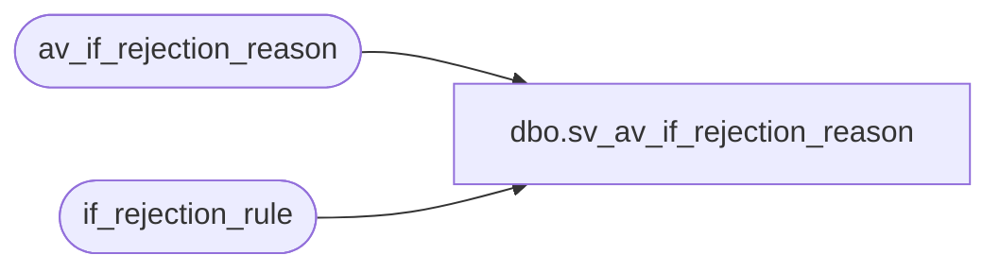

# dbo.sv_av_if_rejection_reason

**Database:** auditworks_external  
**Server:** bedrockdb01  

## Architecture Diagram



## Table Dependencies

| Referenced Table |
|---|
| av_if_rejection_reason |
| if_rejection_rule |

## View Code

```sql
create view dbo.sv_av_if_rejection_reason     as
SELECT transaction_id = av_transaction_id, line_id, if_reject_reason,
	deferred, memo1, memo2, memo3, replace_upc_no, replace_line_object,
	replace_line_action, process_id, lookup_key1, b.if_rejection_description 
	FROM av_if_rejection_reason a,  if_rejection_rule b
WHERE a.if_reject_reason = b.if_rejection_reason
```

