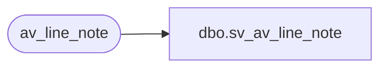

# dbo.sv_av_line_note

**Database:** auditworks_external  
**Server:** bedrockdb01  

## Architecture Diagram



## Table Dependencies

| Referenced Table |
|---|
| av_line_note |

## View Code

```sql
create view dbo.sv_av_line_note
as

/* SmartView: Rename the av_transaction_id field */

SELECT transaction_id = av_transaction_id, line_id, note_type, line_note
	FROM av_line_note
```

