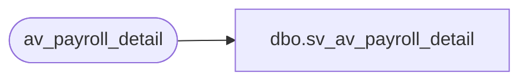

# dbo.sv_av_payroll_detail

**Database:** auditworks_external  
**Server:** bedrockdb01  

## Architecture Diagram



## Table Dependencies

| Referenced Table |
|---|
| av_payroll_detail |

## View Code

```sql
create view dbo.sv_av_payroll_detail
as

/* SmartView: Rename the av_transaction_id field */

SELECT transaction_id = av_transaction_id, line_id, employee_no, 
	payroll_date, employee_payroll_id, employee_type, payroll_entry_type
	FROM av_payroll_detail
```

