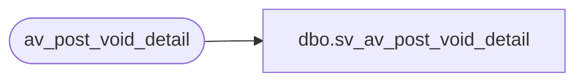

# dbo.sv_av_post_void_detail

**Database:** auditworks_external  
**Server:** bedrockdb01  

## Architecture Diagram



## Table Dependencies

| Referenced Table |
|---|
| av_post_void_detail |

## View Code

```sql
create view dbo.sv_av_post_void_detail
as

/* SmartView: Rename the av_transaction_id field */

SELECT transaction_id = av_transaction_id, line_id, post_voided_register,
	post_voided_trans_no, post_void_successful, post_void_reason_code
	FROM av_post_void_detail
```

