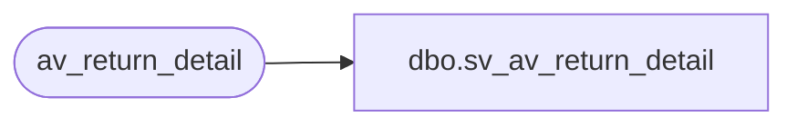

# dbo.sv_av_return_detail

**Database:** auditworks_external  
**Server:** bedrockdb01  

## Architecture Diagram



## Table Dependencies

| Referenced Table |
|---|
| av_return_detail |

## View Code

```sql
create view dbo.sv_av_return_detail
as

/* SmartView: Rename the av_transaction_id field */

SELECT transaction_id = av_transaction_id, line_id, return_reason_message,
	return_reason_code, mdse_disposition_code, via_warehouse_flag, 
	original_salesperson, original_salesperson2, return_from_store,
	return_from_reg, return_from_date, return_from_transno, without_receipt_flag
	FROM av_return_detail
```

