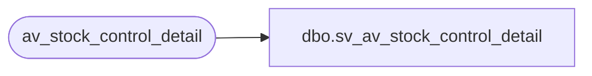

# dbo.sv_av_stock_control_detail

**Database:** auditworks_external  
**Server:** bedrockdb01  

## Architecture Diagram



## Table Dependencies

| Referenced Table |
|---|
| av_stock_control_detail |

## View Code

```sql
create view dbo.sv_av_stock_control_detail
as

/* SmartView: Rename the av_transaction_id field */

SELECT transaction_id = av_transaction_id, line_id, upc_no, 
	merchandise_key, initiated_by_host, units, other_store_no,
	location_no, vendor_no, count_date, pos_identifier, pos_identifier_type, pos_deptclass, upc_lookup_division,
	originating_store_no, display_def_id, sku_id, reason, imrd, style_reference_id
 FROM av_stock_control_detail
```

