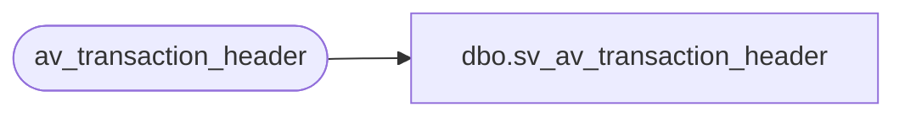

# dbo.sv_av_transaction_header

**Database:** auditworks_external  
**Server:** bedrockdb01  

## Architecture Diagram



## Table Dependencies

| Referenced Table |
|---|
| av_transaction_header |

## View Code

```sql
create view dbo.sv_av_transaction_header  as
SELECT av_transaction_id AS transaction_id, store_no, register_no,
	transaction_date, date_reject_id, transaction_series,
	transaction_no, entry_date_time, cashier_no, transaction_category,
	tender_total, transaction_void_flag, customer_info_exists,
	exception_flag, sa_rejection_flag, if_rejection_flag,
	deposit_declaration_flag, closeout_flag, media_count_flag, customer_modified_flag,
	tax_override_flag, pos_tax_jurisdiction, edit_progress_flag,
	edit_timestamp, employee_no, transaction_remark,
	copy_transaction_id, last_modified_date_time, in_use_timestamp,
	till_no, updated_by_user_id
	FROM av_transaction_header
```

