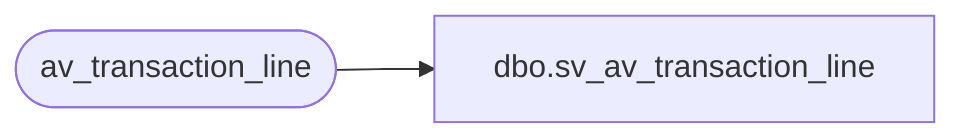

# dbo.sv_av_transaction_line

**Database:** auditworks_external  
**Server:** bedrockdb01  

## Architecture Diagram



## Table Dependencies

| Referenced Table |
|---|
| av_transaction_line |

## View Code

```sql
create view dbo.sv_av_transaction_line
as

/* SmartView: Rename the av_transaction_id field */

SELECT transaction_id = av_transaction_id, line_id, line_sequence,
	line_object_type, line_object, line_action, gross_line_amount,
	pos_discount_amount, db_cr_none, attachment_qty, exception_flag,
	interface_rejection_flag, line_void_flag, voiding_reversal_flag,
	edit_timestamp, reference_type, reference_no
	FROM av_transaction_line
```

