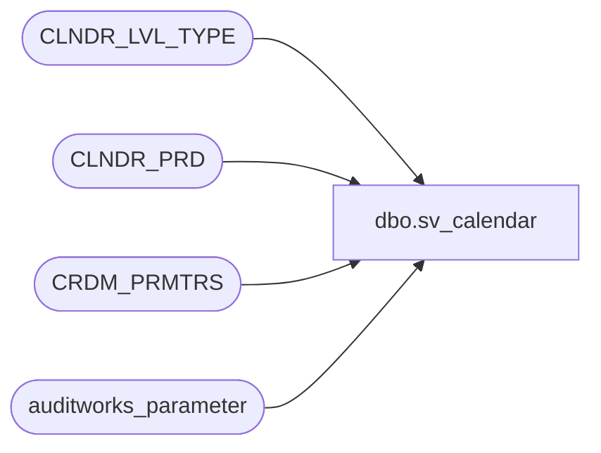

# dbo.sv_calendar

**Database:** auditworks_external  
**Server:** bedrockdb01  

## Architecture Diagram



## Table Dependencies

| Referenced Table |
|---|
| CLNDR_LVL_TYPE |
| CLNDR_PRD |
| CRDM_PRMTRS |
| auditworks_parameter |

## View Code

```sql
create view dbo.sv_calendar as
SELECT   calendar_date = CP.STRT_DATE_TIME, 
         month_end_flag =  CASE WHEN CP.END_DATE_TIME = MON.END_DATE_TIME
                               THEN 'M'
                               ELSE NULL
                           END,
         week_end_flag = CASE WHEN CP.END_DATE_TIME = WEEK.END_DATE_TIME
                               THEN 'W'
                               ELSE NULL
                           END,
         year_end_flag = CASE WHEN CP.END_DATE_TIME = YR.END_DATE_TIME
                               THEN 'Y'
                               ELSE NULL
                           END,                  
         merchandise_month_no = MON.CLNDR_PRD_NUM,
         merchandise_year_no =  YR.CLNDR_PRD_NUM,
         merchandise_week_no = WEEK.CLNDR_PRD_NUM 
FROM CLNDR_PRD CP
JOIN CLNDR_LVL_TYPE DY
     ON DY.TIME_SPAN = 1440
     AND DY.CLNDR_LVL_TYPE_ID = CP.CLNDR_LVL_TYPE_ID   
JOIN CRDM_PRMTRS PARAM
     ON CP.CLNDR_ID = PARAM.PRMTR_VAL_BIN
     AND PARAM.PRMTR_NAME = 'GL_PSTNG_CLNDR_ID'
JOIN auditworks_parameter apw
     ON apw.par_name = 'clndr_lvl_month'     
JOIN CLNDR_PRD MON
     ON MON.CLNDR_LVL_TYPE_ID = apw.par_bin_value
     AND MON.STRT_DATE_TIME <= CP.STRT_DATE_TIME
     AND MON.END_DATE_TIME > CP.STRT_DATE_TIME
     AND MON.CLNDR_ID =PARAM.PRMTR_VAL_BIN
JOIN CLNDR_LVL_TYPE WK
     ON WK.TIME_SPAN = 10080
JOIN CLNDR_PRD WEEK
     ON  WK.CLNDR_LVL_TYPE_ID = WEEK.CLNDR_LVL_TYPE_ID   
     AND WEEK.STRT_DATE_TIME <= CP.STRT_DATE_TIME
     AND WEEK.END_DATE_TIME > CP.STRT_DATE_TIME
JOIN auditworks_parameter apy
     ON apy.par_name = 'clndr_lvl_year'   
JOIN CLNDR_PRD YR
     ON YR.CLNDR_ID = PARAM.PRMTR_VAL_BIN
     AND YR.CLNDR_LVL_TYPE_ID = apy.par_bin_value
     AND YR.STRT_DATE_TIME <= CP.STRT_DATE_TIME
     AND YR.END_DATE_TIME > CP.STRT_DATE_TIME
```

