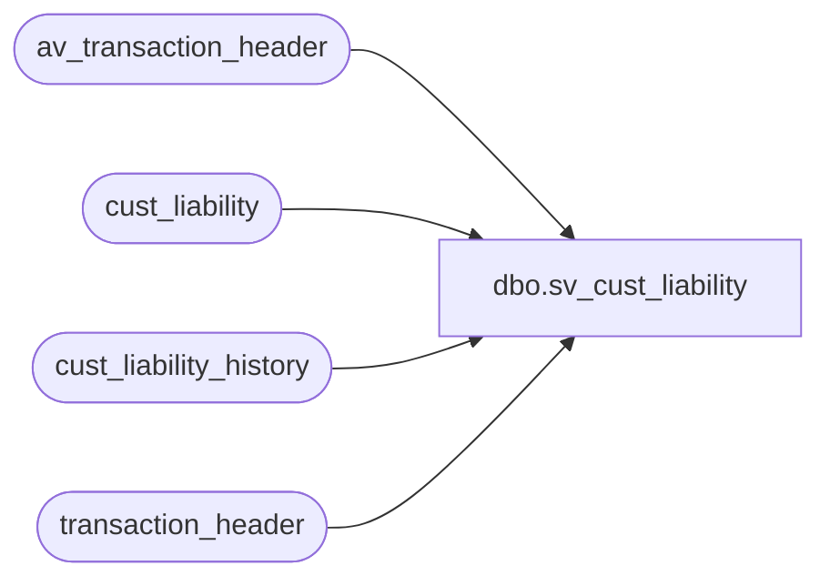

# dbo.sv_cust_liability

**Database:** auditworks_external  
**Server:** bedrockdb01  

## Architecture Diagram



## Table Dependencies

| Referenced Table |
|---|
| av_transaction_header |
| cust_liability |
| cust_liability_history |
| transaction_header |

## View Code

```sql
create view dbo.sv_cust_liability      
      (customer_liability_entry_no,
       glc_type, 
       reference_no,
       key_store_no,       
       tracking_id, 
       transaction_date,
       transaction_void_flag, 
       store_no, 
       register_no, 
       transaction_no, 
       entry_date_time,
       cashier_no,
       title,              
       first_name,        
       last_name,        
       address_1, 
       address_2,                    
       city,        
       state,
       county, 
       country,
       post_code,
       telephone_no1, 
       telephone_no2, 
       customer_no,        
       transaction_series        
       )
as
select 1,
       c.reference_type, 
       c.reference_no,
       c.key_store_no,       
       c.tracking_id, 
       t.transaction_date,
       t.transaction_void_flag, 
       t.store_no, 
       t.register_no, 
       t.transaction_no, 
       t.entry_date_time,
       t.cashier_no,
       title,              
       first_name,        
       last_name,        
       address_1, 
       address_2,                    
       city,        
       state,
       county, 
       country,
       post_code,
       telephone_no1, 
       telephone_no2, 
       customer_no,        
       t.transaction_series 
  from cust_liability c, 
       cust_liability_history h, 
       transaction_header t
 where c.reference_type = h.reference_type
   AND c.reference_no = h.reference_no 
   and c.key_store_no = h.key_store_no
   and h.process_key = t.transaction_id
UNION
select 1,
       c.reference_type, 
       c.reference_no,
       c.key_store_no,       
       c.tracking_id, 
       t.transaction_date,
       t.transaction_void_flag, 
       t.store_no, 
       t.register_no, 
       t.transaction_no, 
       t.entry_date_time,
       t.cashier_no,
       title,              
       first_name,        
       last_name,        
       address_1, 
       address_2,                    
       city,        
       state,
       county, 
       country,
       post_code,
       telephone_no1, 
       telephone_no2, 
       customer_no,        
       t. transaction_series 
  from cust_liability c, 
       cust_liability_history h, 
       av_transaction_header t
 where c.reference_type = h.reference_type
   AND c.reference_no = h.reference_no 
   and c.key_store_no = h.key_store_no
   and h.process_key = t.av_transaction_id
```

