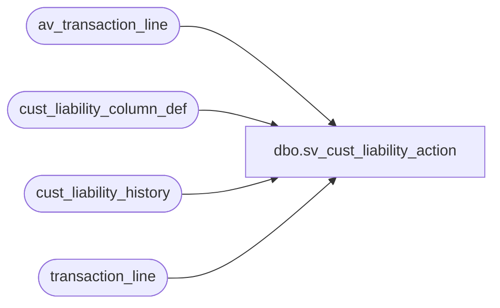

# dbo.sv_cust_liability_action

**Database:** auditworks_external  
**Server:** bedrockdb01  

## Architecture Diagram



## Table Dependencies

| Referenced Table |
|---|
| av_transaction_line |
| cust_liability_column_def |
| cust_liability_history |
| transaction_line |

## View Code

```sql
create view dbo.sv_cust_liability_action      
(customer_liability_entry_no, 
customer_liability_action_no , 
glc_type, 
reference_no,
key_store_no,
object,  
action, 
amount, 
outstanding_to_customer, 
issuance, 
redemption, 
layaway_sale, 
layaway_payment, 
layaway_cancellation, 
layaway_balance_receivable, 
layaway_forfeiture,
transaction_date)
AS
SELECT 1, 
       2,
       c.reference_type, 
       c.reference_no,
       c.key_store_no,
       l.line_object,
       l.line_action, 
       l.gross_line_amount AS amount,
SUM(  ABS(SIGN(ABS(1-def.column_no))-1)*l.gross_line_amount*def.factor*voiding_reversal_flag)   AS outstanding_to_customer, 
SUM(  ABS(SIGN(ABS(3-def.column_no))-1)*l.gross_line_amount*def.factor*voiding_reversal_flag*(1-ABS(SIGN(l.line_action-24)))) AS issuance, 
SUM(  ABS(SIGN(ABS(4-def.column_no))-1)*l.gross_line_amount*def.factor*voiding_reversal_flag*ABS(SIGN(l.line_action-54))) AS redemption,
SUM(  ABS(SIGN(ABS(3-def.column_no))-1)*l.gross_line_amount*def.factor*voiding_reversal_flag*(1-ABS(SIGN(l.line_action-38))))  AS layaway_sale , 
SUM(  ABS(SIGN(ABS(5-def.column_no))-1)*l.gross_line_amount*def.factor*voiding_reversal_flag*(1-ABS(SIGN(l.line_action-13)))) AS layaway_payment, 
SUM(  ABS(SIGN(ABS(4-def.column_no))-1)*l.gross_line_amount*def.factor*voiding_reversal_flag*(1-ABS(SIGN(l.line_action-54))))  AS layaway_cancellation, 
SUM(  ABS(SIGN(ABS(2-def.column_no))-1)*l.gross_line_amount*def.factor*voiding_reversal_flag) AS layaway_balance_receivable,  
SUM(  ABS(SIGN(ABS(7-def.column_no))-1)*l.gross_line_amount*def.factor*voiding_reversal_flag) AS layaway_forfeiture,   
   c.transaction_date
from cust_liability_history c,
     transaction_line l,
     cust_liability_column_def def
where c.process_key = l.transaction_id
and c.reference_type = l.reference_type
and c.reference_no = l.reference_no
and l.line_action <> 60 -- stocked
and def.unit_amount_flag = 1
and def.line_action = l.line_action
and def.line_object_type = l.line_object_type
and def.reference_type = l.reference_type
group by c.reference_type,
       c.reference_no,
       c.key_store_no,  
       l.line_object, 
       l.line_action, 
       l.gross_line_amount,            
       c.transaction_date
UNION
SELECT 1, 
       2,
       c.reference_type, 
       c.reference_no,
       c.key_store_no,
       l.line_object,
       l.line_action, 
       l.gross_line_amount AS amount,
SUM(  ABS(SIGN(ABS(1-def.column_no))-1)*l.gross_line_amount*def.factor*voiding_reversal_flag)   AS outstanding_to_customer, 
SUM(  ABS(SIGN(ABS(3-def.column_no))-1)*l.gross_line_amount*def.factor*voiding_reversal_flag*(1-ABS(SIGN(l.line_action-24)))) AS issuance, 
SUM(  ABS(SIGN(ABS(4-def.column_no))-1)*l.gross_line_amount*def.factor*voiding_reversal_flag*ABS(SIGN(l.line_action-54))) AS redemption,
SUM(  ABS(SIGN(ABS(3-def.column_no))-1)*l.gross_line_amount*def.factor*voiding_reversal_flag*(1-ABS(SIGN(l.line_action-38))))  AS layaway_sale , 
SUM(  ABS(SIGN(ABS(5-def.column_no))-1)*l.gross_line_amount*def.factor*voiding_reversal_flag*(1-ABS(SIGN(l.line_action-13)))) AS layaway_payment, 
SUM(  ABS(SIGN(ABS(4-def.column_no))-1)*l.gross_line_amount*def.factor*voiding_reversal_flag*(1-ABS(SIGN(l.line_action-54))))  AS layaway_cancellation, 
SUM(  ABS(SIGN(ABS(2-def.column_no))-1)*l.gross_line_amount*def.factor*voiding_reversal_flag) AS layaway_balance_receivable,  
SUM(  ABS(SIGN(ABS(7-def.column_no))-1)*l.gross_line_amount*def.factor*voiding_reversal_flag) AS layaway_forfeiture,
c.transaction_date
from cust_liability_history c,
     av_transaction_line l,
     cust_liability_column_def def
where c.process_key = l.av_transaction_id
and c.reference_type = l.reference_type
and c.reference_no = l.reference_no
and l.line_action <> 60 -- stocked
and def.unit_amount_flag = 1
and def.line_action = l.line_action
and def.line_object_type = l.line_object_type
and def.reference_type = l.reference_type
group by c.reference_type,
       c.reference_no,
       c.key_store_no,  
       l.line_object,        
       l.line_action, 
       l.gross_line_amount,            
       c.transaction_date
```

