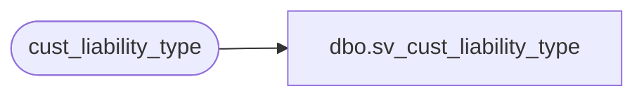

# dbo.sv_cust_liability_type

**Database:** auditworks_external  
**Server:** bedrockdb01  

## Architecture Diagram



## Table Dependencies

| Referenced Table |
|---|
| cust_liability_type |

## View Code

```sql
create view dbo.sv_cust_liability_type          
      (reference_type, 
       tracking_id, 
       tracking_id_description, 
       expiry_days, 
       customer_liability_group,
       glc_type,
       resource_id)
as
select reference_type , 
       tracking_id , 
       tracking_id_description,
       expiry_days,
       customer_liability_group,
       reference_type, 
       resource_id
  from cust_liability_type
```

