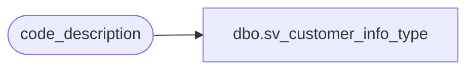

# dbo.sv_customer_info_type

**Database:** auditworks_external  
**Server:** bedrockdb01  

## Architecture Diagram



## Table Dependencies

| Referenced Table |
|---|
| code_description |

## View Code

```sql
create view dbo.sv_customer_info_type

AS

select customer_info_type = code,  customer_info_descr = code_display_descr
from code_description
where code_type = 8
```

