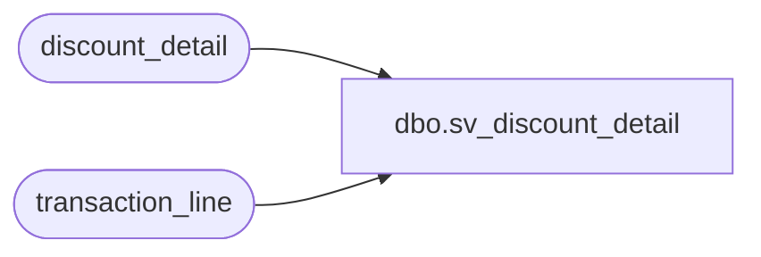

# dbo.sv_discount_detail

**Database:** auditworks_external  
**Server:** bedrockdb01  

## Architecture Diagram



## Table Dependencies

| Referenced Table |
|---|
| discount_detail |
| transaction_line |

## View Code

```sql
create view dbo.sv_discount_detail  as
SELECT  d.transaction_id, d.line_id, d.applied_by_line_id,
	d.pos_discount_level, d.pos_discount_type, d.pos_discount_amount,
	d.applied_flag, d.pos_discount_serial_no, l.db_cr_none
	FROM discount_detail d, transaction_line l
	WHERE d.transaction_id =l.transaction_id
	AND d.line_id = l.line_id
```

