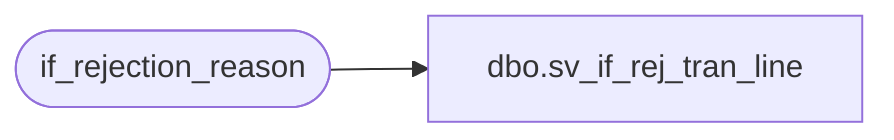

# dbo.sv_if_rej_tran_line

**Database:** auditworks_external  
**Server:** bedrockdb01  

## Architecture Diagram



## Table Dependencies

| Referenced Table |
|---|
| if_rejection_reason |

## View Code

```sql
create view dbo.sv_if_rej_tran_line 
as
SELECT  transaction_id, line_id
FROM if_rejection_reason
```

