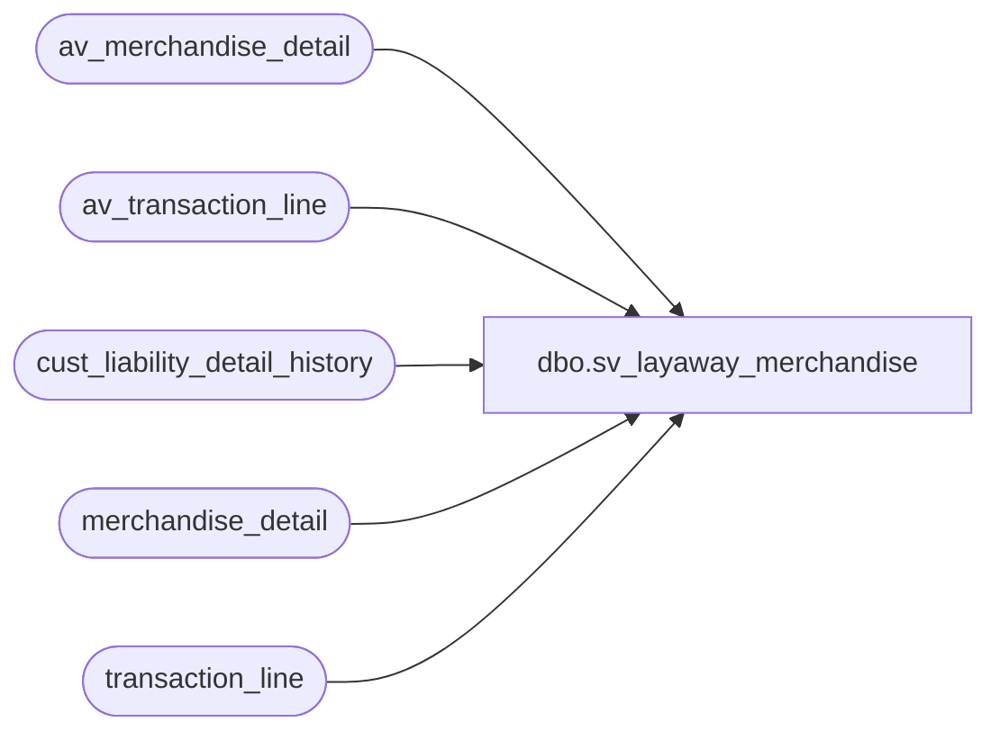

# dbo.sv_layaway_merchandise

**Database:** auditworks_external  
**Server:** bedrockdb01  

## Architecture Diagram



## Table Dependencies

| Referenced Table |
|---|
| av_merchandise_detail |
| av_transaction_line |
| cust_liability_detail_history |
| merchandise_detail |
| transaction_line |

## View Code

```sql
create view dbo.sv_layaway_merchandise    
(customer_liability_entry_no,
  customer_liability_action_no,
  glc_type,
  reference_no,
  key_store_no,
  upc_lookup_division,
  upc_no,
  style_reference_id,
  units,
  sold_at_price,
  salesperson,
  salesperson2)
as
select 1,
       2,
       c.reference_type,
       c.reference_no,
       c.key_store_no,       
       c.upc_lookup_division,
       c.upc_no,
       m.style_reference_id,
       m.units,
       m.sold_at_price,
       m.salesperson,
       m.salesperson2
from merchandise_detail m, 
     transaction_line l,
     cust_liability_detail_history c
where c.process_key =l.transaction_id
  and c.line_object = l.line_object
  and line_action in (101,102,201,202,219)
  and l.transaction_id = m.transaction_id
  and l.line_id = m.line_id
  and c.upc_no = m.upc_no
  and c.upc_lookup_division = m.upc_lookup_division   
UNION  
select 1,
       2,
       c.reference_type,
       c.reference_no,
       c.key_store_no,       
       c.upc_lookup_division,
       c.upc_no,
       m.style_reference_id,
       m.units,
       m.sold_at_price,
       m.salesperson,
       m.salesperson2
from av_merchandise_detail m, 
     av_transaction_line l,
     cust_liability_detail_history c
where c.process_key =l.av_transaction_id
  and c.line_object = l.line_object
  and l.av_transaction_id = m.av_transaction_id
  and l.line_id = m.line_id                         
  and c.upc_no = m.upc_no
  and c.upc_lookup_division = m.upc_lookup_division
```

