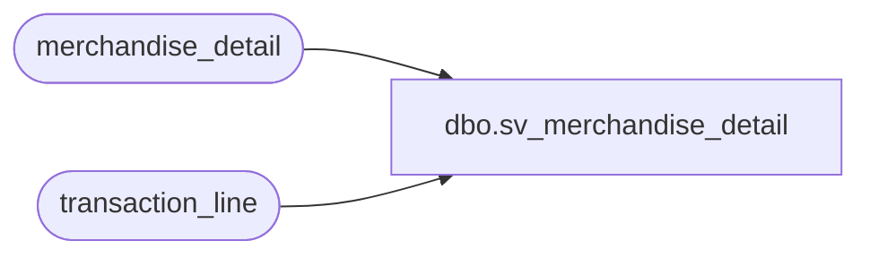

# dbo.sv_merchandise_detail

**Database:** auditworks_external  
**Server:** bedrockdb01  

## Architecture Diagram



## Table Dependencies

| Referenced Table |
|---|
| merchandise_detail |
| transaction_line |

## View Code

```sql
create view dbo.sv_merchandise_detail   AS
SELECT  m.transaction_id, m.line_id, merchandise_category,
	upc_lookup_division, upc_no, units, salesperson, salesperson2,
	sku_id, style_reference_id, class_code, subclass_code, price_override,
	pos_iplu_missing, upc_on_file_flag, pos_deptclass, ticket_price,
	sold_at_price, pos_identifier, l.db_cr_none, l.voiding_reversal_flag, l.line_void_flag, l.line_object, l.line_action,
	plu_price, pos_identifier_type, salesperson_on_file_flag, salesperson2_on_file_flag, scanned, originating_store_no, source_store_no, fulfillment_store_no, m.cost
	FROM merchandise_detail m, transaction_line l
	WHERE m.transaction_id = l.transaction_id
	AND m.line_id = l.line_id
```

