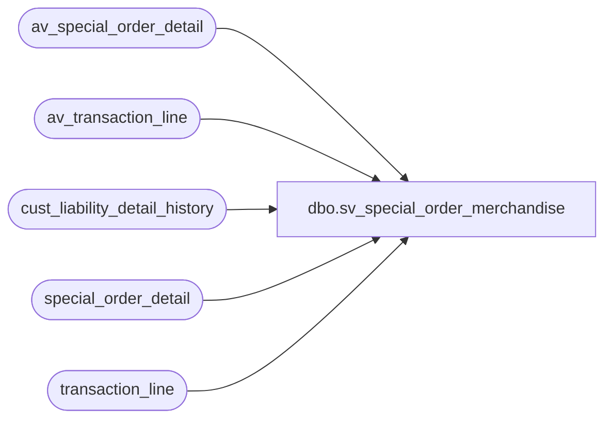

# dbo.sv_special_order_merchandise

**Database:** auditworks_external  
**Server:** bedrockdb01  

## Architecture Diagram



## Table Dependencies

| Referenced Table |
|---|
| av_special_order_detail |
| av_transaction_line |
| cust_liability_detail_history |
| special_order_detail |
| transaction_line |

## View Code

```sql
create view dbo.sv_special_order_merchandise   
 (customer_liability_entry_no,
  customer_liability_action_no,
  glc_type,
  reference_no,
  key_store_no,        
  new_upc_flag,
  units,
  salesperson,
  merchandise_description,
  expection_delivery_on,
  color_description,
  size_description,
  width_description,
  vendor_name,
  vendor_style_description,
  spo_class_description,
  vendor)
as
select 1,
       2,
  c.reference_type,
  c.reference_no,
  c.key_store_no,         
  0, --new_upc_flag,
  units,
  salesperson,
  merchandise_description,
  expecting_delivery_on,
  color_description,
  size_description,
  width_description,
  vendor_name,
  vendor_style_description,
  spo_class_description,
  vendor_no
from special_order_detail s,
     transaction_line l,
     cust_liability_detail_history c
where c.process_key =l.transaction_id
  and c.line_object = l.line_object
  and l.transaction_id =s.transaction_id
  and l.line_id = s.line_id
UNION
select 1,
       2,
  c.reference_type,
  c.reference_no,
  c.key_store_no,         
  0,  --new_upc_flag,
  units,
  salesperson,
  merchandise_description,
  expecting_delivery_on,
  color_description,
  size_description,
  width_description,
  vendor_name,
  vendor_style_description,
  spo_class_description,
  vendor_no
from av_special_order_detail s,
     av_transaction_line l,
     cust_liability_detail_history c
where c.process_key =l.av_transaction_id
  and c.line_object = l.line_object
  and l.av_transaction_id =s.av_transaction_id
  and l.line_id = s.line_id
```

